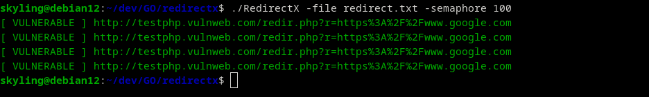

<p align="center">
  
</p>

# RedirectX
RedirectX es un script diseñado para la automatización de escaneos de OpenRedirect.
## ⬇️ INSTALL

```bash
go install github.com/SkyLingRQ/RedirectX@latest
```

## 📝 USAGE
```bash
Usage RedirectX:
  -file string
        Archivo con las URLs a escanear. (default "redirect.txt")
  -semaphore int
        Implementar semaforo personalizado. (default 50)
```

## 👨🏼‍💻 Linux Terminal
```bash
RedirectX -file archivo_con_urls.txt -semaphore Implementar semaforo personalizado (Por defecto 50)
```

## 📷 Capture

